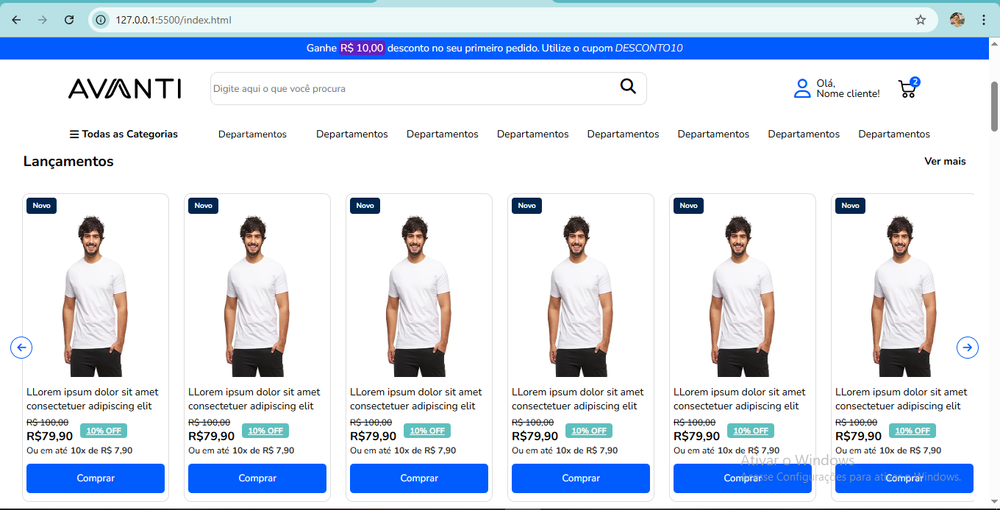
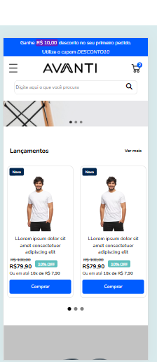

[JAVASCRIPT__BADGE]: https://img.shields.io/badge/Javascript-000?style=for-the-badge&logo=javascript
[NODE__BADGE]: https://cdn4.iconfinder.com/data/icons/logos-3/454/nodejs-new-pantone-white-512.png
[PROJECT__BADGE]: https://img.shields.io/badge/📱Visit_this_project-000?style=for-the-badge&logo=project
[PROJECT__URL]: https://github.com/Fernanda-Kipper/Readme-Templates

<h1 align="center" style="font-weight: bold;"> Desenvolvimento do Layout  💻</h1>

<p align="center">
 <a href="#about">Sobre</a> • 
 <a href="#images">Funcionamento</a> • 
  <a href="#install">Instalação</a>
</p>

<h2 id="started">📌 Sobre</h2>

O projeto foi desenvolvido com a linguagem JavaScript pura, HTML e CSS. A aplicação consiste em simular o layout de um ecommerce onde o usuário tem a visão dos produtos ou serviços que a empresa oferta. O projeto possui responsividade o que torna mais agradável para o usuário que utiliza-lo me dispositivos móvies.

<h2 id="started">📌 Funcionalidades</h2>

- Carrosel animado tanto no formato desktop quanto no mobile;
- Animação no campo de busca, caso o usuário digite algo será mostrado na tela o que ele digitou.

<h2 id="images">📍 Funcionamento</h2>

<p align="center">
    
</p>

<p align="center">
    
</p>

<p align="center">
    
</p>

<h2 id="started">🚀 Instalação</h2>

<h3>Clonando</h3>

```bash
git clone https://github.com/Higor-Santanna/Projeto-01---Desenvolvimento-do-Layout-.git
```

Entre na pasta, e aperte o botão no inferior direito escrito "golive". Caso não tenha basta instalar essa funcionalidade no VSCode.